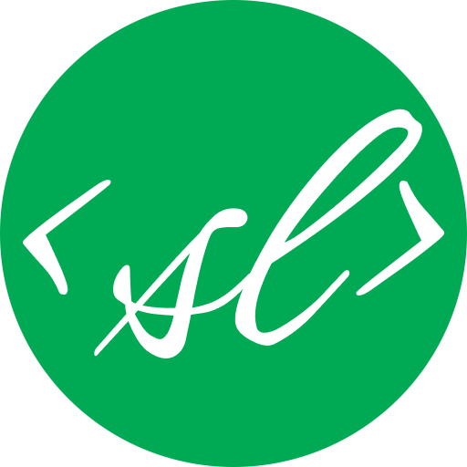

<div style="display: flex; align-items: center; justify-content: center; gap: 10px;">
  
  <h1 style="margin: 0; font-family: Arial, sans-serif; font-size: 24px;d"> scriptLab | Onestop JavaScript solution </h1>
</div>

<br/>


The application focuses in bringing the best of the Javascript that there is. The page is beautifullly crafted with uniform design so that your learing experience is not affected. This documentation page brings out the joy and twist of the Javascript language that you will love to taste. 

We will see you in our website ! 

### FEATURES FOR VERSION 0.1.0 
- Comfortable UI experience. 
- Easy theme toggle button.
- Chapter wise topics and concepts.
- On page code editor to run and execute all your codes.
- Smooth page animations. 

### CONTRIBUTION TO THIS PROJECT
Fork our repository on your github profile
```bash 
  git clone <ssh_link>
```
```bash 
  cd SCRIPTLAB/ 
```
```bash
  bun install || npm install 
```
Make sure to branch out of main and create your branch 
<br>
Surely following conventional branch naming and commits
```bash
  git branch <branch_name>
```
Push your changes to remote and create a pull request
```bash
  git push origin <branch_name>
```

We are more then happy to see your Pull request hanging in our repository.

<hr>

### Cheers ! ✨
##### TEAM SNIPPETS
